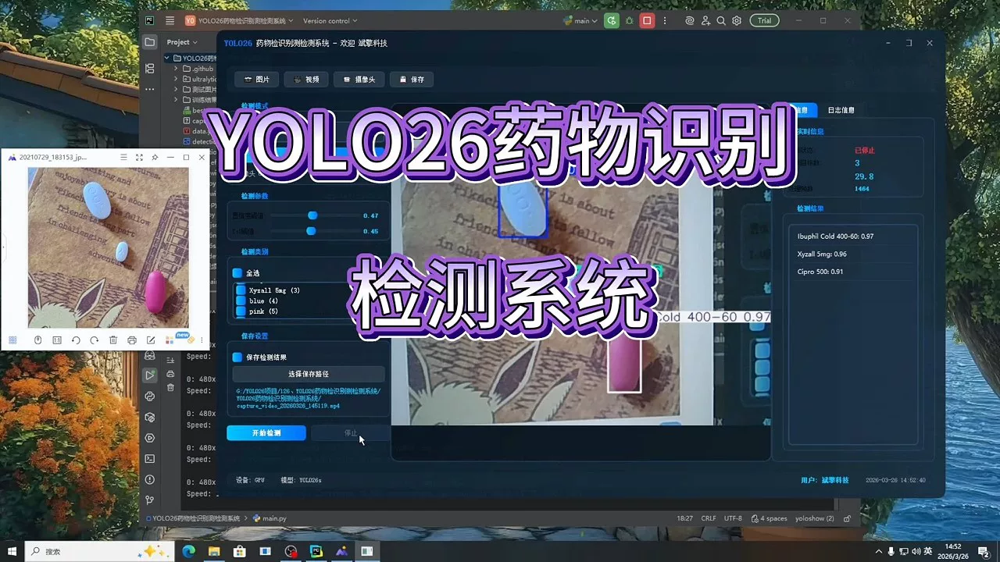
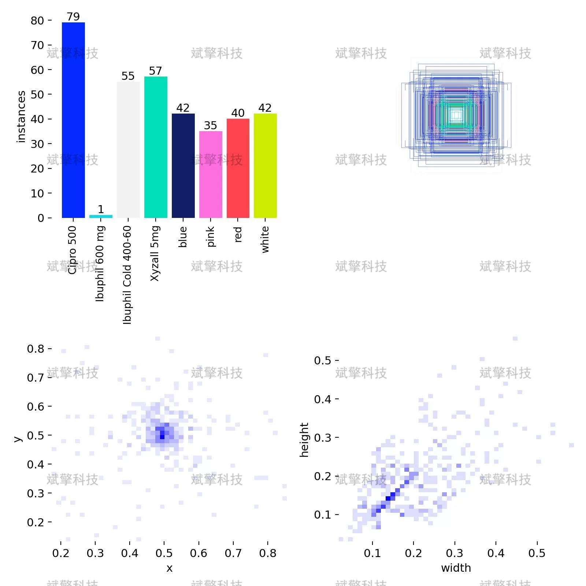
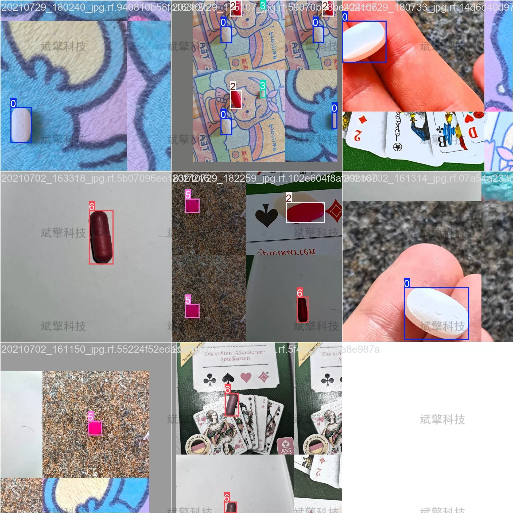
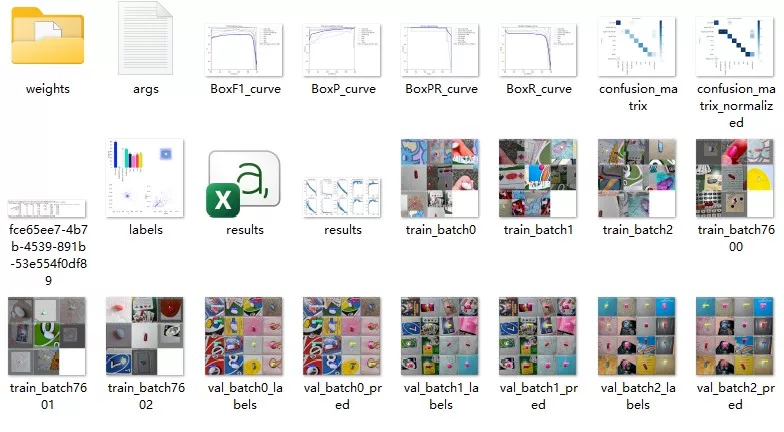
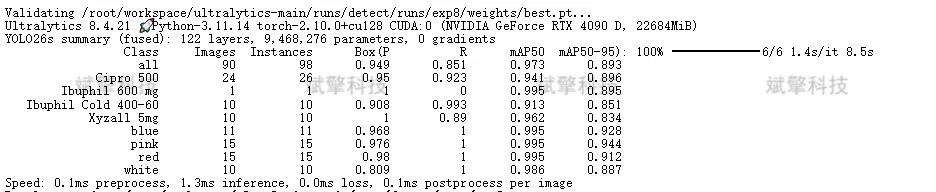
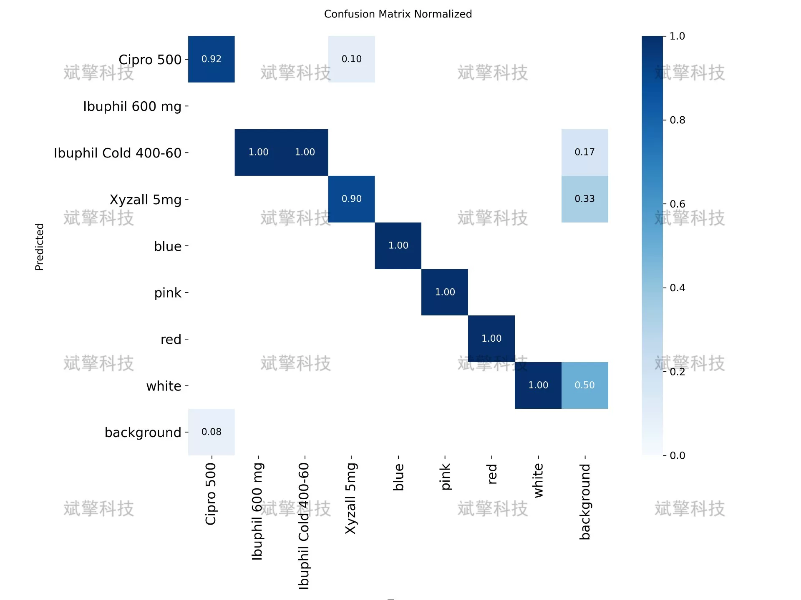
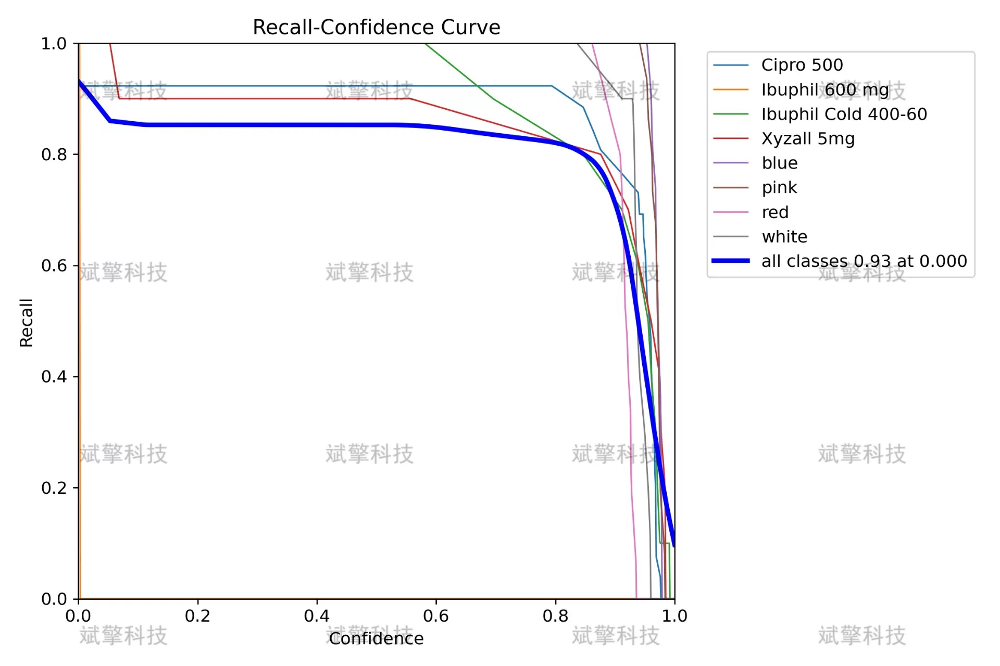
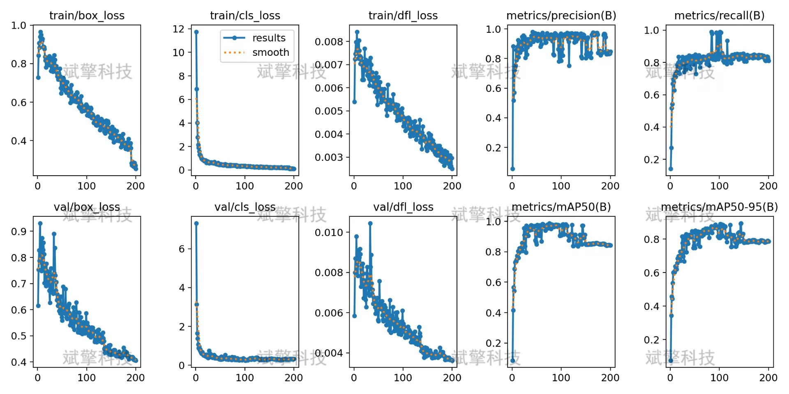

# YOLOv26 Pharmaceutical Recognition Detection System | Model + Source Code

## Body

YOLO26 Pharmaceutical Identification System | Model + Source Code

This research addresses the needs of the pharmaceutical identification field by constructing a drug detection system based on YOLO26, aiming to achieve automatic recognition of various drugs and their color attributes. The system can identify eight categories, including four drugs (Cipro 500, Ibuphil 600 mg, Ibuphil Cold 400-60, Xyzall 5mg) and four color attributes (blue, pink, red, white). The experimental data consists of 451 labeled images, divided into training set (316), validation set (90), and test set (45). The model achieved excellent performance on the validation set, with an overall mAP50 of 0.973, mAP50-95 of 0.893, precision of 0.949, and recall rate of 0.851. Among the categories, the recognition effect for color attributes was the best, with a recall rate of 1.0 in each category, and the mAP50 for drug categories also exceeded 0.89. The experimental results show that this system can effectively recognize various drugs and their color characteristics, demonstrating good practical value and application prospects.

Drug Name Class:
Cipro 500: An antibiotic drug, with 26 labeled samples
Ibuphil 600 mg: A ibuprofen preparation, with only one instance due to limited samples
Ibuphil Cold 400-60: A compound cold medicine, with 10 labeled samples
Xyzall 5mg: An antihistamine drug, with 10 labeled samples
Color Attribute Class:
blue (blue): Drug's blue characteristic, with 15 labeled samples
pink (pink): Drug's pink characteristic, with 15 labeled samples
red (red): Drug's red characteristic, with 15 labeled samples
white (white): Drug's white characteristic, with 10 labeled samples

Free appointment for remote installation. Unsuccessful installation will result in full refund.
Purchase comes with the following resources (unlocked in Baidu Cloud):
YOLO Identification Project Complete Source Code
YOLO format datasets
Training code + UI interface code
Trained model + results image
Software installation package
Add WeChat for remote installation (automatically displayed after purchase) - Unsuccessful, full refund

⚙️ Core Functional Modules
Detection Capability
Image detection: upload and detect, return detection box + category information
Video detection: supports video files, analyzes frames accurately
Camera real-time detection: connects to USB camera, realizes dynamic monitoring
Interaction and Control
Target selection: freely choose one or more categories for detection
Parameter real-time adjustment: adjustable confidence threshold & IoU threshold, flexible control accuracy
Result saving: save images/videos/camera detection results in one click
System and Data
User login registration: Supports password strength detection + encryption storage
Log recording: automatically records operation and error information (timestamped)

## Images

## Payment

Here is a pay link on Stripe ( https://buy.stripe.com/3cs8yP7sY87d0vu9AB ). Please contact me lonlonago@foxmail.com after funding $89, and I will send you a complete data files , thank you!

